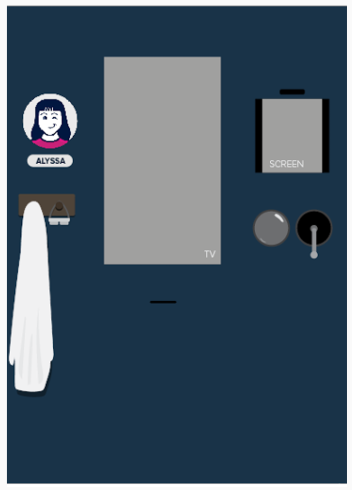
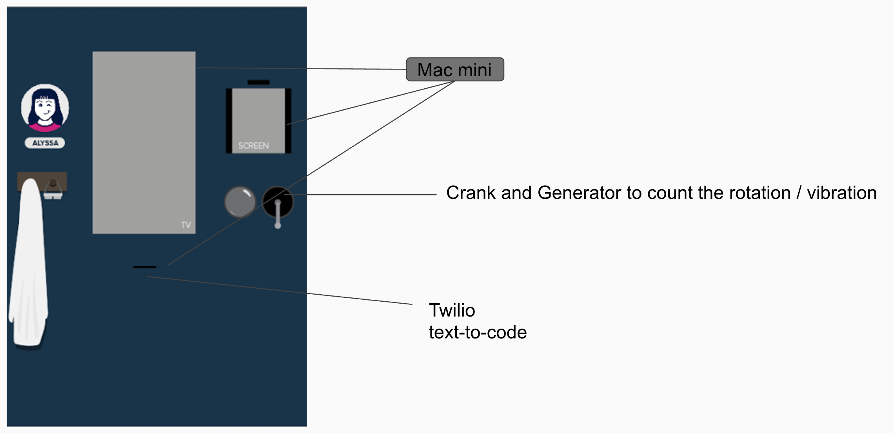
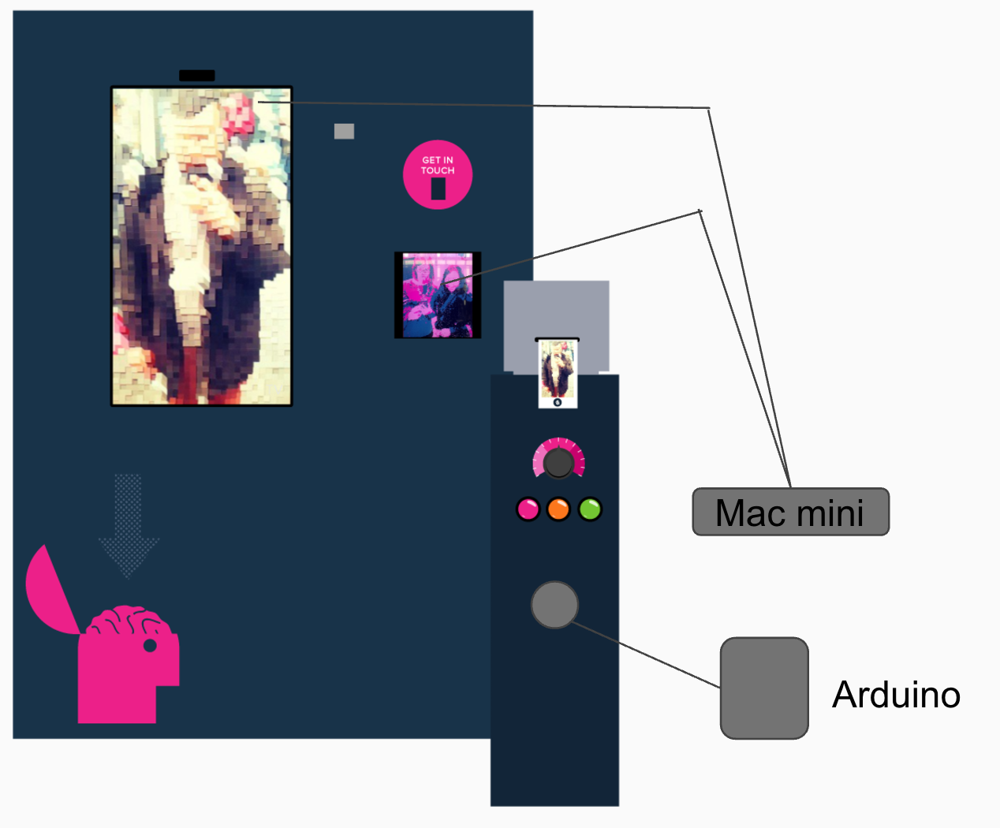
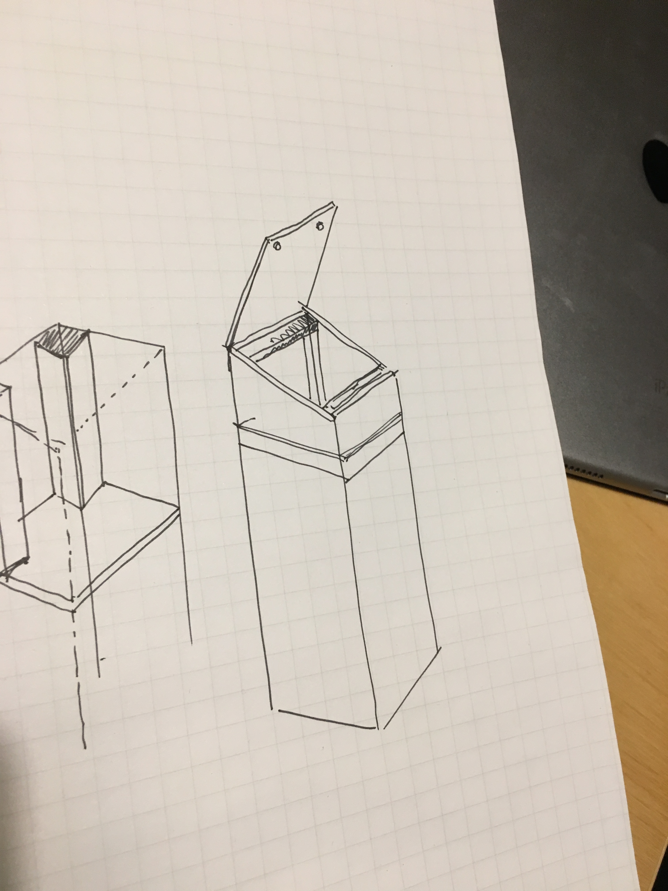

#Full Stack TO Meetup
## At Art & Science Experience Design

---

# The Road to DX3 2017

---
# Who's Art & Science?

* Started as an agency's agency
* Solved technical and creative problems big agencies couldn't
* Sick of being "whitelabeled" and oversold

> We're a digital agency that brings unique experiences at the confluence of design ("Art") and technology ("Science")

---
# Why DX3?

> DX3 is positioned at the confluence of retail, marketing and technology.

* Moderate lead gen
* Some exposure to new tech
* Decent social / media / portfolio opportunity
* Amazing opportunity to engage the creativity of the whole team
* "Dry run" for complicated activations.

> "It's Showtime!"

---
# A&S Objectives for Dx3 2017

* Provide an authentic Art & Science brand experience.
* Demonstrate our thinking, capabilities and culture.
* Have interactive experiences.
* Include a “takeaway” for booth visitors.

> **Feel:** “This was the coolest booth at the show.”

> **Say:** “I’m interested in chatting with A&S further about a project or problem I need solved.

> **Do:** Engage with us on social media and post content that includes our booth

---
# Planning the Journey

1. Team ideation
2. Concept finalization
8. Technology proof-of-concept
9. Solution briefs
10. Build!
13. Tech previews
14. Contingency plan / Deployment plan
15. Move-in and set-up
16. The Days Of
17. Teardown and move-out
18. Post-mortem

---
# Team Ideation

[Adam & Spence Kickoff](assets/videos/adam_spence_edit.mp4)
<video src="assets/adam_spence_edit.mp4"></video>

1. Identify outcomes and objectives - "can I buy THAT"?
2. Target budget and timeline
3. Team brief
4. Ideation, presentation and proposals

* Great way to bring the team together creatively
* Bad way to define tightly scoped high-value activations

---
# Lots and Lots of Ideas...

---
# Concept Finalization

5. Regroup, sanity check
6. Small-group ideation
7. Refinement, concept finalization

Challenge: keeping the larger group engaged and rewarded for their contributions.

---
# Final Concepts

## Keep it simple

## 5 Activations

1. The Monster Maker
2. The Magic Mirrors
3. The Periodic Table of Elements (Portfolio)
4. 4D Pong ("Subatomic Smash")
5. The Plasma Ball!

---

# How are we gonna get this shit done??

Thank heavens for the winter holiday.

---

# Build!

* 1-2 devs per activation
* Ownership over the activation
* Assigned designer
* Bi-weekly scrums (15 minutes)
* Post-it notes!

---

# The Monster Maker: a study in MVP

Original vision:
* Activate the experience by touching van de Graaf ball
* Spin up a large crank - hair stands on end
* After #revs, show "reflection" in a digital mirror
* Take snapshot and capture surprise
* Show snapshot in a gallery

> What could possibly go wrong?

Revised vision:

[Monster Maker Video](assets/videos/monster_maker.mp4)

---
# Monster Maker tech

* Scene powered by Unity

* Pre-defined monster "parts" from Rhino
* Map snapshot of webcam through shader to face model

* Basic home-grown Serial protocol for Arduino interchange
* Home-grown capacitive touch detection
* Printout to thermal printer

* Twilio connection from server to phone

* Hall effect sensor on crank

* Sketching monsters is fun!!!

* Making monsters is more fun!

---

# Magic Mirrors

[Transmogrifier Video](/assets/videos/dx3_transmogrifier.mp4)

* Building on past successes
* Scaling the process to multiple devs and designers

* Building the control box PROTOTYPE!!

[Magic Mirrors Box Prototype Build Videos](assets/videos/mmbox_build_1.mp4)

* Building the actual Box

* Prototype All The Things (incl. Vinyl)

* Designing the controls and affordances

* Electronics are weird

* Takeaways are cool!

---

# Periodic Table (portfolio)

* Adafruit Fadecandy == 60 pixels per port :(
* Go Nano (clone)!

* Lighting is easy; diffusion is hard!

* Socket.io is cool

---

# Subatomic Smash

[Subatomic Smash Video](assets/videos/dx3_subatomicsmash_4.mp4)

* From Mystery Box to 4-person Video Game

[BCC Mystery Box Video](assets/videos/bcc_mystery_box.mp4)

* hardest part: choosing a name
* Second hardest part: depth perception
* Also hard: difficulty balancing
* Also, controllers

* Also: assembly!

---

# Plasma Ball?

[Plasma Boomerang](/assets/videos/plasma.mp4)

---

# How did it go?

1,262 Games of Subatomic Smash played (half by booth staffers)
345 "Transmogrifications"
284 Monsters created

> Tons of great conversations, a pile of Instagram activity and 1 amazing video reel.

---

# 1,692 dev hours over 70 days

---

# Lessons Learned

* prototype everything
* Electronics are HARD

[Soldering Station Malfunction video](assets/videos/soldering.mp4)

* Physical components are HARDER
* Dry run your dry run
* And then change NOTHING... unless you have to

---
# Go Play!!!

tom@artscience.ca

@tomauger

